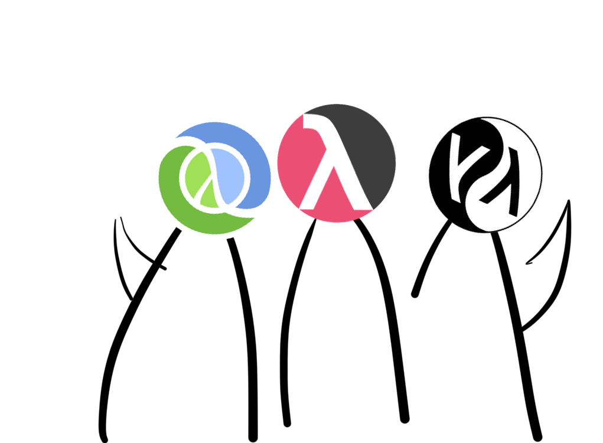
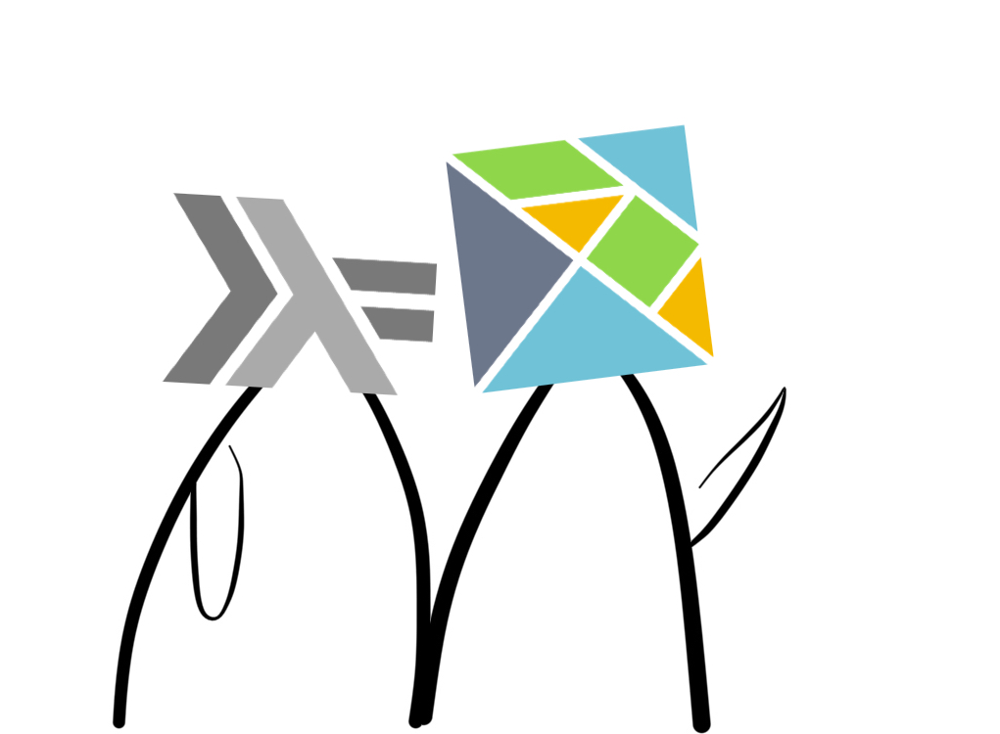
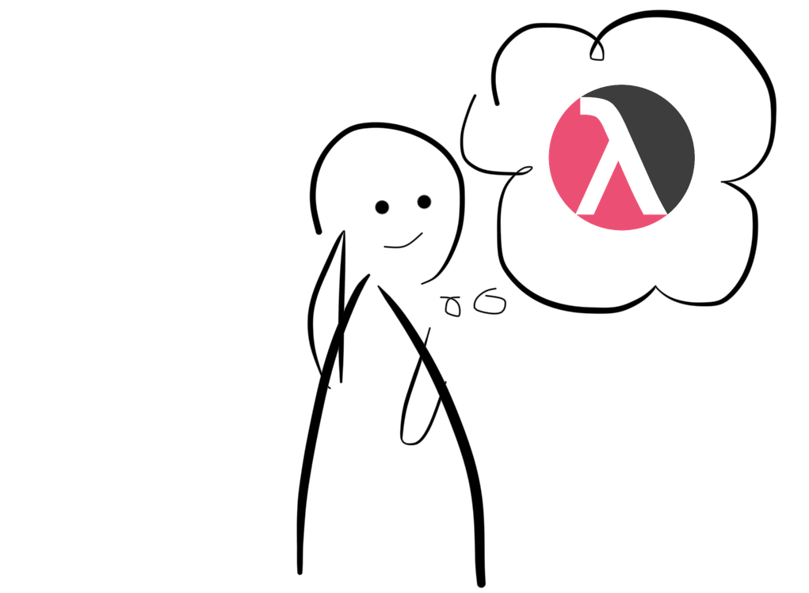
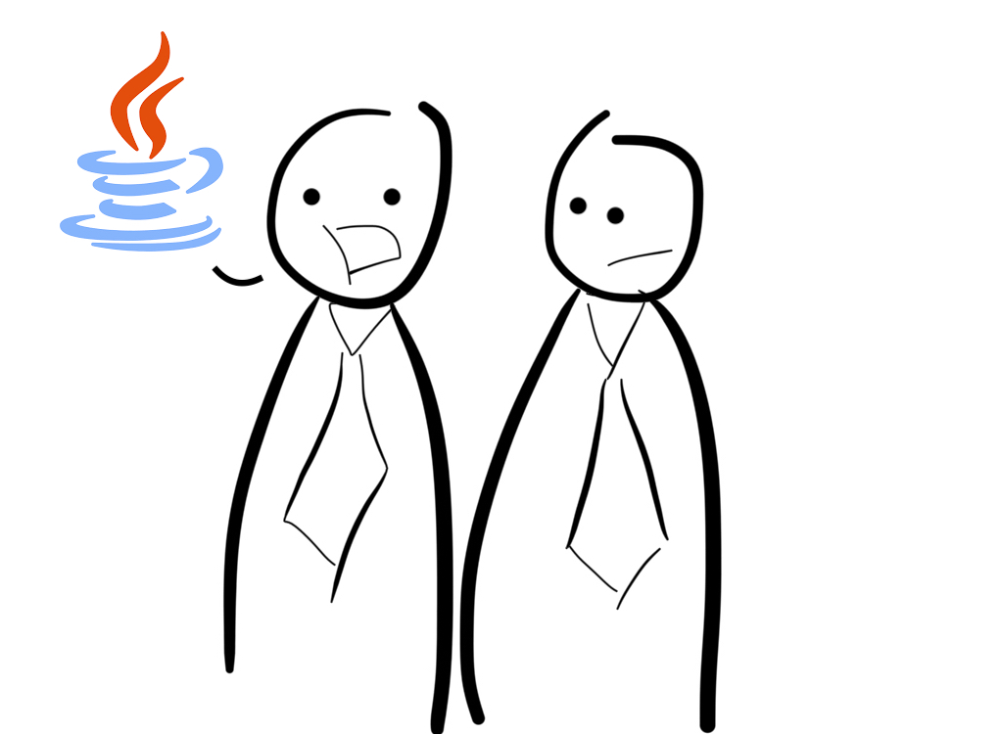
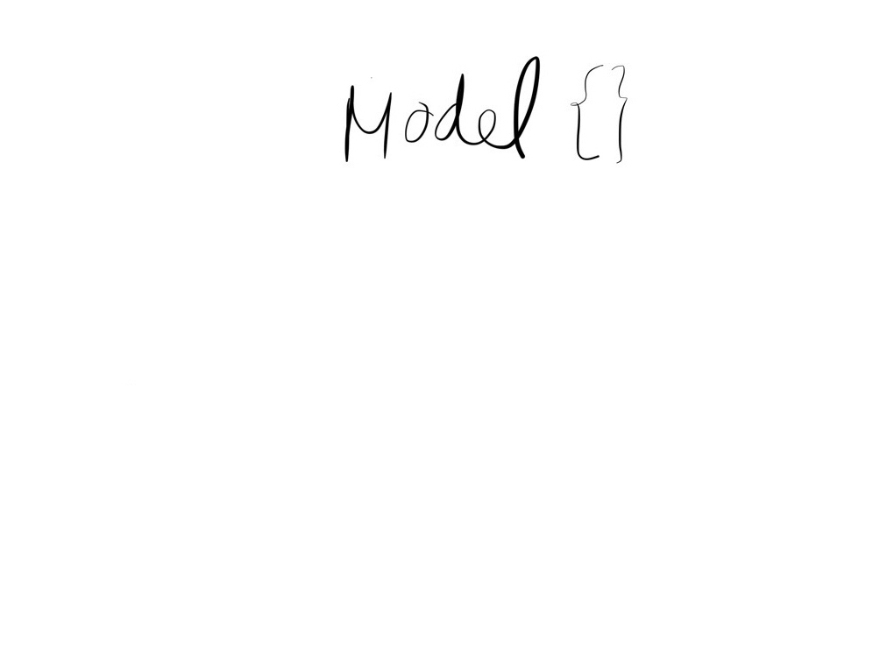
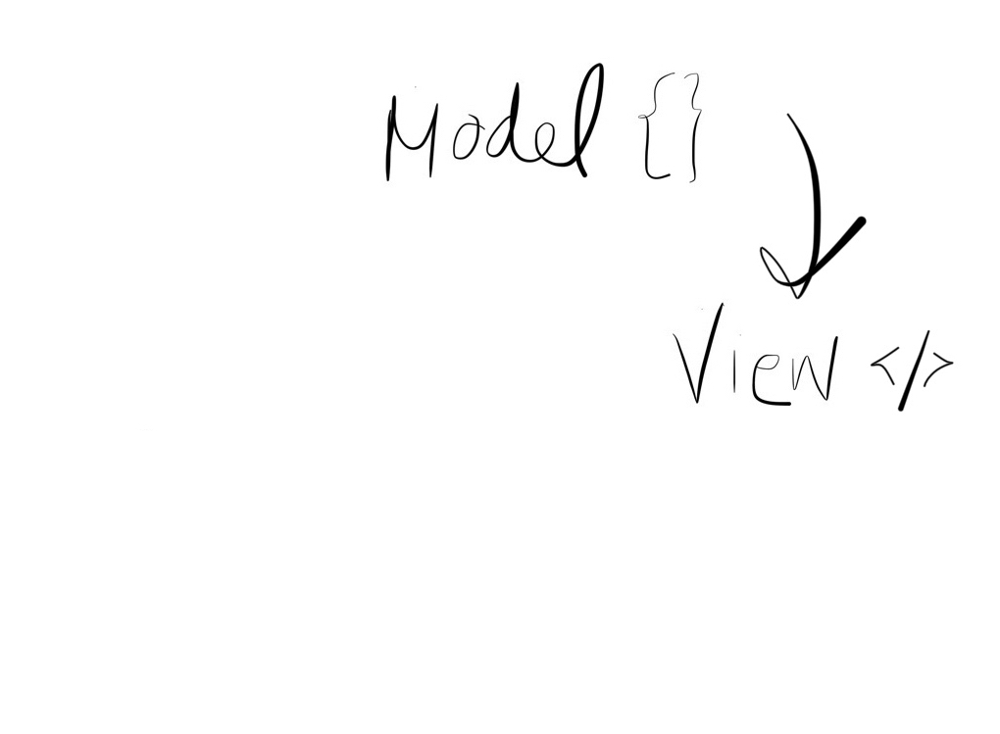
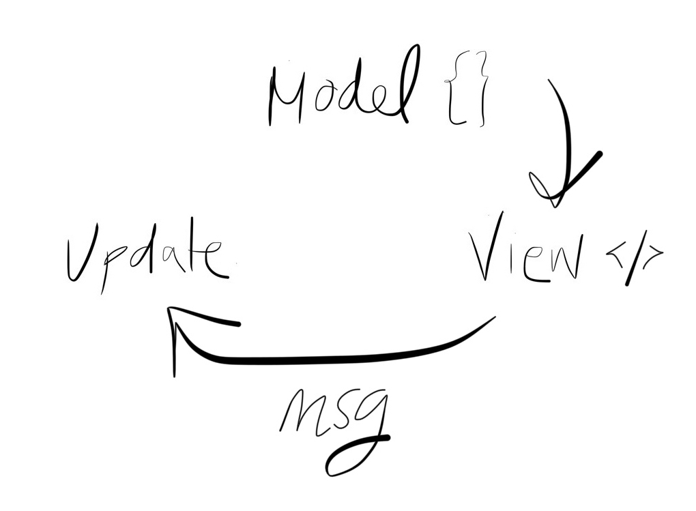
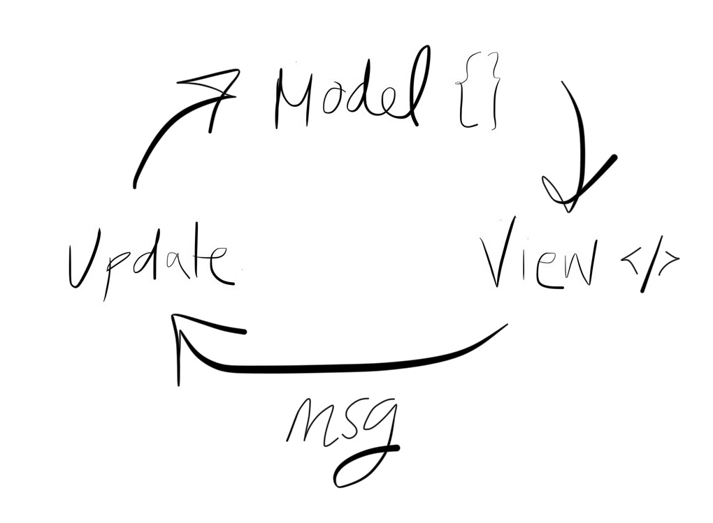

# [fit] Elm


[.footer: Aksel Wester og Johanne Håøy Horn, Bekk Consulting AS]

^
Vi har gleden av å starte denne todelte gjesteforelesningen.
Denne delen skal handle om Elm, et helt nydelig funksjonelt programmeringsspråk jeg håper dere også snart får sansen for.
Mitt navn er johanne, <Aksel>
* Gikk ut av IFI i 2016
* Tok INF2810 (og digga det). Faktisk var vi tre som holder forelesning i dag alltid på samme gruppe, leverte obliger og gjorde det forferdelig dårlig på påskequizen sammen. (Har de fortsatt påskequiz). 
* I dag: Jobber i Bekk som utviklere


---

## Plan

* Funksjonell programmering og webapplikasjoner
* Syntaks og språkkonsepter
* Liten app 

^ 
* Snakke litt om våre erfaringer med funksjonell programmering og webutvikling
* Presentere syntaks og noen sentrale språkkonsepter
* Lage en bitteliten webapp.
* Har 45 minutter til rådighet, så vi har dessverre ikke tid til å gå veldig i dybden på Elm som språk, men forhåpentligvis får dere smaken på noe av syntaksen og eventuelt motivasjon til å se på det på egenhånd. 

---

## Funksjonell programmering i arbeidslivet

* God kode
* Brukervennlig, testbar, lesbar kode
* Vi bruker kanskje ikke Scheme, men prinsippene er universelle

^ Aksel: Da jeg skulle velge fag på våren andre året så fikk jeg høre at funksjonell programmering var et kult fag, selv om det ikke er så relevant for arbeidslivet. Men det viste seg å ikke stemme i det hele tatt. Funksjonell programmering er nok et av de fagene jeg har hatt mest nytte av etter at jeg begynte å jobbe.

^ Funksjonell programmering som konsept har fått mer og mer fotfeste de siste årene, og man ser at prinsippene i funksjonell programmering er anvendelige på mange forskjellige bruksområder.

^ Noen av grunnene til det, er at hvis man skriver funksjonelt, så skriver man kode uten sideeffekter, som gjør det lett å resonnere om hva et program gjør ved å se på koden.

^ Funksjonell kode er også lett å teste og lett å lese, og det blir ofte mindre kode.

---


 

^ Aksel: Scheme er et språk i Lisp-familien av funksjonelle språk, og det er Clojure også. Lisp-familien kjennetegnes som oftest ved at språkene er dynamisk typet (og også at de har masse parenteser)

^ Elm er en del av ML-familien, som har veldig mange av de samme konseptene som språk i Lisp-familien, men med et typesystem i tillegg

^ Men i motsetning til typesystemene dere kanskje er kjent med fra Java, så er typesystemene i ML-språk både mye kraftigere, og mye mindre i veien. Det hjelper deg egentlig bare å unngå feil.

---


^ 
Johanne: Elm er et programmeringsspråk for nettsider, er det greit å bruke noen minutter på å snakke om hva en nettside består av, for å forstå hvilken verden Elm befinner seg i.

---


^
Johanne: Dette er sikkert kjent for en del av dere, men nettsider er bygget på HTML, som vi bruker til å skrive og strukturere tekst.

---


^
Johanne: Vi bruker CSS til å style nettsidene våre, altså for å sette opp layouten vi ønsker, få farger, rett og slett gjøre det pent. En litt gøyal greie for oss på IFI, er at CSS faktisk har sitt opphav her på instituttet, som doktorgraden til Håkon Wium Lie.

---


^ Og så selve rosinen i pølsa: JavasScript. JavaScript brukes til å gjøre sidene interaktive, og er helt nødvendig i de fleste moderne webapplikasjoner slik vi kjenner dem. Hvis man ønsker noe mer enn en statisk nettside med hardkodet tekst, er det JavaScript som fikser biffen.

---



^ 
For JavaScript ble laget av en fyr som heter Brendan Eich. Og han ville egentlig lage Scheme i nettleseren.

---



^ Men Java var veldig i vinden den gangen, og netscape, nettleseren han skulle lage dette språket for, ville at han skulle ta språket i en mer objektorientert retning.
Og det gjorde han. Ikke minst inngikkk netscape en avtale med sun, som hadde lisensrettighetene til java, om at de fikk lov til å bruke java i navnet til dette nye programmeringsspråket.

---
## Java != JavaScript

^ Men ellers har disse to språkene så å si ingenting å gjøre med hverandre.

---

### JavaScript

* Funksjonelt og objektorientert
* Ikke kompilert
* Dynamisk typet
* Svært fleksibelt

^ 
Funksjonelt og objektorientert.
JavaScript kompileres ikke, det kjører bare rett i nettleseren. Som scheme er det dynamisk typer, det vil si: vi kan sende hva som helst inn til en funksjon, uten at vi vil få noen klager på det, før vi åpner nettsiden og kanskje har fått en kjørefeil.
Det er et utrolig fleksibelt språk, som har ført til en voldsom innovasjon siden det først så dagens lys i 1995.

---


^ 
JavaScript-fatigue
Kan være vanskelig å velge rammeverk og biblioteker.

---

## Tingenes tilstand på frontend

* JS-stacken funker, men er kompleks
* JS har beveget seg i funksjonell retning: React, Redux
* Statisk typing har blitt mainstream

^
Js-stacken: dvs alle de ulike rammeverkene og verktøyene man trenger for å sette opp en webappliakasjon, er kompleks.
Js har de siste årene beveget seg i en mer funksjonell retning, blant annet i rammeverkene React og Redux, som har blitt en slags bransjestandard her til lands. 
Statisk typing har blitt mainstream - dvs at man legger på et rammeverk for å type javascript, som regel innebærer dette at man kompilerer javascripten, og da får feilmeldinger hvis man prøver å bruke typer feil.

---

## Vanlige feil i JS

^
Andre ting som folk irriterer seg grønne over med javascript, er:
* Feiler runtime, det kompileres jo ikke, kjører bare rett i nettleseren.
* Dårlige feilmeldinger

---
	
`Script error.`

---

`Cannot read property 'getFullYear' of undefined`

--- 

`undefined is not a function`

^
Null har jo blitt omtalt som the billion dollar mistake - dukket først opp i cobol.
JavaScript har gjort det enda vanskeligere for seg selv med å slenge undefined med I miksen

---


^ Johanne: Elm er et alternativ til JavaScript

---

### _Elm:_ Laget for webapplikasjoner

^
Elm er én pakke for webapplikasjoner, som vi i en JavaScript-verden bare kan løse ved å kombinere flere rammeverk som React, redux, immutable.js med mer.

---

### _Elm:_ Kompilerer ned til JavaScript

^ Det skal sies, per i dag kompileres Elm ned til JavaScript, for det er det nettleserne har støtte for å kjøre. Men i fremtiden kompilerer det kanskje til noe annet. Ikke et javascriptrammeverk, et eget språk, ikke tett knyttet til js.

---

### _Elm:_ Statisk typet funksjonelt språk

---

### _Elm:_ Lover “ingen kjøretidsfeil”
^
Elm har hverken null eller undefined.

---

### _Elm:_ Gode kompilatorfeilmeldinger

^ Skal se eksempler på dette senere.

---

### _Elm:_ Fokuserer på brukervennlighet

^
Både i språket selv, men også i flyten rundt: feilmeldinger, enkelhet med å komme igang.

---

### _Elm:_ Tydelig, gjennomgående filosofi

^ 
Èn måte å lage webapps på, en konsensus om hva som er den beste måten.
Lett å lære, enkelt å bruke. 

---

### _Elm:_ Offisielt anbefalte biblioteker for det man trenger

---

# Elm

^ Aksel: Da er det på tide å se litt elm. Vi skal gå gjennom den grunnleggende syntaksen, og noen nye konsepter dere kanskje ikke har sett i programmeringsspråk før, og så skal vi se på hvordan vi bygger opp programmer i elm.

^ Til slutt skal vi live-kode en liten interaktiv nettside

---

# Funksjoner & typeinferens

```elm
increment x =
    x + 1

five = increment 4
```

^ Dette er elm. Her har vi en funksjonsdefinisjon, og binding av en verdi til et navn.

^ increment er en funksjon som tar ett argument: `x`, og returnerer `x + 1`. Siden elm er rent funksjonelt, og vi bare kaller funksjoner for returnverdien så har vi ikke noe return-ord. Det er resultatet av evalueringen som returneres, akkurat som i scheme

^ Under binder vi resultatet av å kalle increment med argumentet 4, til navnet five

---

# Funksjoner & typeinferens

```elm
increment x =
    x + 1

five = increment 4
```

^ Selv om elm har et typesystem så er man ikke pålagt å legge på typer, men man får fortsatt hjelp av kompilatoren. Så her forstår elm at increment tar et tall som argument og returnerer et tall, på grunn av pluss-operatoren.

^ Så dersom vi hadde prøvd å kalle increment med en streng så hadde vi ikke fått kompilere

---

# Typesignaturer

```elm

increment : Int -> Int
increment x =
    x + 1

five : Int
five = increment 4
```

^ Men som oftest så har vi lyst til å legge på typesignaturer, og det gjør vi på denne måten.

^ Kolon betyr "har typen", så øverst står det at increment har typen int-til-int, altså er det en funksjon som tar inn en int og returnerer en int

^ five derimot er bare en int. Det er ikke noen piler fordi five ikke er noen funksjon

^ En ting som er fint med typesignaturene til elm, er at de fungerer omtrent som dokumentasjon, i tillegg til å hjelpe kompilatoren. For hvis du ser at en funksjon heter f.eks. `increment` og tar en int og returnerer en int, så behøver du egentlig ikke se på implementasjonen for å skjønne hva den gjør. Og det er sant for veldig mange funksjoner i elm.

---

# Records

```elm
kunde : { navn : String, alder : Int }
kunde = 
    { navn = "Ingar"
    , alder = 24
    }
```

^ For mer komplekse datatyper har elm bl.a. records. En record er litt som et objekt i javascript eller et HashMap i java. Her lager vi en record `kunde`, som har to felter: `navn` med verdi `Ingar` og `alder` med verdi `24`

^ I tillegg så har vi en typesignatur på `kunde` som sier at dette er en record, der `navn` er en streng, og `alder` er en int.

---

# Type alias

```elm
type alias Kunde =
    { navn: String
    , alder: Int
    }

ingar : Kunde
ingar =
    { navn = "Ingar"
    , alder = 24
    }   
```

^ Fordi vi vil at typesystemet skal hjelpe oss, og ikke være i veien, så har vi noe som heter typealias, som lar oss definere navn på typer. Det gjør vi sånn at vi kan definere typen vår én gang, og så slippe å skrive den flere ganger.

^ Så her definerer vi typealiaset `Kunde` og sier at det er det samme som et record med to felter, `navn` som er en streng, `alder` som er en int.

#### **Lar oss definere nye typer**

---

# Type alias

```elm
type alias Koordinater = (Int, Int)

spillerposisjon : Koordinater
spillerposisjon = (0, 0)
```

^ Her har vi et annet eksempel til på et typealias, hvor vi gir navnet Koordinater til et tuppel av to int’er.


^ Og så sier vi at spillerposisjon har typen Koordinater, og er 0-0

^ Tupler defineres med parenteser

---

# Type alias

```elm
type alias Kunde =
    { navn: String
    , alder: Int,
    , avtale: String
    }

ingar : Kunde
ingar =
    { navn = "Ingar"
    , alder = 24
    , avtale = "Student"
    }   
```

^ En ting som er fint med å bruke typealias er at vi kan endre typealiaset et sted, og så sier kompilator fra alle steder vi må oppdatere programmet vårt.

^ Her har vi lagt til et felt `avtale` i recorden, som er en streng, for å vise at dette er en studentkunde.

---

# Type alias

```elm
type alias Kunde =
    { navn: String
    , alder: Int,
    , avtale: String
    , studentRabatt: Int
    }

ingar : Kunde
ingar =
    { navn = "Ingar"
    , alder = 24
    , avtale = "Student",
    , studentRabatt = 50
    }
```

^ Videre så kan vi se for oss at vi legger til et felt `studentRabatt` i typealiaset vårt

---

# Type alias

```elm
type alias Kunde =
    { navn: String
    , alder: Int,
    , avtale: String
    , studentRabatt: Int
    , bedriftsnavn: String
    }

ingar : Kunde
ingar =
    { navn = "Ingar"
    , alder = 24
    , avtale = "Bedrift",
    , studentRabatt = 0
    , bedriftsnavn = "Bekk Consulting"
    }
```

^ Men hva nå da? Nå har vi laget en bedriftskunde, som vi ser på `avtale`-feltet, og vi har lagt til et felt i typealiaset som heter `bedriftsnavn`

^ Men vi har jo fortsatt studentRabatten, selv om det ikke er noen studentkunde, fordi studentRabatt er definert i typealiaset vårt.

---

# Tre problemer:
_1. Vi får tomme felter med_ dummy-_verdier_
_2. Enkelt å skrive feil i `type`-feltet_
_3. Ikke noe hjelp fra kompilatoren_

^ 1, 2, 3

^ ... i JavaScript så ville vi kanskje godtatt at det er sånn man modellerer objekter, men ikke i elm!

---

# Union Types

```elm
type Kundeavtale
    = Student
    | Bedrift
    | Privat
```

#### **Som enums på stereoider**


^ Johanne: Disse problemene kan vi løse i Elm ved å bruke det som heter union types.

^ Union types er litt som enums, men mye mye kraftigere. Og for de av dere som ikke kjenner til enums, er det en type man definerer til å være et sett med konstanter.

^ Union types deklareres ved å skrive type og så navnet på union typen - her Kundeavtale.
Og i vårt tilfelle opererer vi med tre ulike avtaler: Student, Bedrift og Privat.

^ Det betyr da at det bare er tre gyldige verdier når vi bruker typen Kundeavtale: Student eller Bedrift eller Privat, og alt annet vil kompilatoren klage på.

---

# Union Types

```elm
type Kundeavtale
    = Student Int
    | Bedrift String 
    | Privat
```

^ Så var det jo sånn at vi hadde en studentrabatt og et bedriftsnavn på type aliaset vårt. Som gjorde at vi måtte sette dummyverdier. Men i elm, kan Union types ha argumenter. Så i stedet for å ha et eget felt for studentrabatt, sender vi en int med student-typen. Og en streng til bedriftavtalen. Privatkunder har ingen ekstra informasjon, så den trenger ikke noen argumenter.

---

# Union Types

```elm
type alias Rabatt = Int
type alias Bedriftsnavn = String

type Kundeavtale
    = Student Rabatt
    | Bedrift Bedriftsnavn 
    | Privat
```

^
Type alias for å gjøre signaturene til typene enklere å lese. Men Student tar fortsatt en int og bedrift tar fortsatt inn en streng.

---

```elm
type alias Kunde =
    { navn: String
    , alder: Int,
    , avtale: Kundeavtale
    }

ingar : Kunde
ingar =
    { navn = "Ingar"
    , alder = 24
    , avtale = Bedrift "Bekk Consulting"
    }   
```

^
Tilbake til eksempelet med kunde-typen, har vi nå erstattet strengen med vår nye union type
Ikke lenger unødvendige og forvirrende felter, bare den informasjonen vi trenger.

---

# Pattern Matching

```elm
type Kundeavtale = Student Rabatt | Bedrift Bedriftsnavn | Privat

getRabatt : Kundeavtale -> Rabatt
getRabatt avtale =
    case avtale of
        Student rabatt ->
            rabatt
        Bedrift navn ->
            0
        Private ->
            0
```


#### **Glemt en branch? kompilatoren sier fra!**


^
Når vi ønsker å håndtere de ulike tilfellene vi har definert at en union type kan ha, bruker vi det som heter pattern matching. 
Likner litt på en switch, som man finner i blant annet java, c# og javascript, men hjelper oss mye mer. For her må vi håndtere alle tilfeller, det holder ikke å bare plukke ut de vi tror vi trenger å håndtere.

^Virker kanskje litt voldsomt, men det å måtte håndtere alle brancher, og få hjelp til kompilatoren, hjelper oss med å skrive kode som fungerer, også etter refaktoreringer og utvidelser.

---

# Maybe

```elm
type Maybe a = Just a | Nothing
```
^ Aksel: Så skal vi snakke om Maybe. Dette er måten elm slipper å ha null, undefined eller lignende

^ På definisjonen så ser vi at Maybe er en unionstype, som enten er Just eller Nothing. Den a-en der betyr bare en vilkårlig type.

---

# Maybe

```elm
type Maybe a = Just a | Nothing

type alias Game = 
    { highscore: Maybe Int
    }
```

^ Her ser vi at vi definerer et spill med en highscore som har typen Maybe Int. Det vil si at highscore _enten_ er Just med en int, _eller_ Nothing, hvis det ikke finnes noen highscore.

^ Som en optional, bare at man er tvunget til å ta hensyn til tilfellet der verdien ikke er tilstede

---

# Maybe

```elm
type Maybe a = Just a | Nothing

type alias Game = 
    { highscore: Maybe Int
    }

getHighscore : Game -> String
getHighscore game =
    case game.highscore of
        Just score ->
            toString score
        Nothing ->
            "No highscore"
```

^ Her ser vi hvordan det brukes, i en case. Og det kule med elm er at man _må_ ta hensyn til alle tilfeller i en case, så det er ikke mulig å bare anta at highscore er der, og risikere en NullPointerException eller lignende. Vi blir tvunget til å sjekke for å få tilgang til verdien.

---

# HTML

```html
<div>
    
    <h1>Min elm-app!</h1>
</div>
```

^
Som jeg nevnte tidligere, er elm en fullstendig løsning for webapplikasjoner - selv om man som regel fortsatt skriver vanlig css. Og elm har dermed sin egen måte å skrive html på.

^ Det er kanskje noen av dere som ikke har sett html før. Men her har vi altså et div-element med to underelementer: et bilde og en header.

---

# HTML

```elm
div []
    [ img [src "/image.png"] []
    , h1 [] [ text "Min elm-app!"]
    ]
```

^ 
Overordnet, er strukturen veldig lik den vi har i html, og attributter og elementer like så. Men html-elementer er nå egne funksjoner i elm. Det vil sei at div er en funksjon, img er en funksjon, h1 (header) er en funksjon osv. Og hver av html-elementene tar inn to argumenter: en liste med attributter, der vi typisk setter cssen. Og en liste med underelementer.
Ellers likner måten vi forholder oss til html i elm litt på hvordan vi bruker komponenter i React.

---

## The Elm Architecture

^ Aksel: Det siste vi skal snakke om før vi skal live-kode er The Elm Architecture.

^ Elm-arkitekturen er måten vi strukturer programmene våre i elm. Arkitekturen består av 3 elementer, en modell, et view og en update-funksjon. Dette vil virke kjent for dere som har brukt redux i javascript, for Elm var faktisk en viktig innflytelse på Dan Abramov som lagde Redux.

---



^ Model: tilstanden til programmet

^ Modellen inneholder all data vi har i programmet, og er det eneste stedet den dataen lever

---



^ View: en funksjon som tar modellen som argument og lager et brukergrensesnitt basert på det

---



^ Update: en funksjon som tar imot beskjeder OG en modell, og returnerer en ny modell

---



^ Starter med en modell som lager et view, view sender beskjeder (f.eks. ved at brukeren trykker på en knapp), og update tar imot beskjeden og lager en ny modell, som igjen oppdaterer viewet, som kan sende beskjeder, og sånn går det, i en evig rund-dans

---

# The Elm Architecture

```elm
type alias Model = ...
type Msg = Forskjellige | Beskjeder

view : Model -> Html Msg

update : Msg -> Model -> Model

```

^ Her er signaturene til de forskjellige elementene til elm-arkitekturen

^ Vi har et typealias `Model` som vi definerer selv, og unionstypen Msg som vi også definerer selv

^ Så har vi de to funksjonene, `view` som tar modellen som argument og returnerer Html. Og der ser vi også at det står Html Msg, fordi vi definerer at Html’en vår kan sende Msg-typen.

^ Til slutt har vi update funksjonen som tar to argumenter: `Msg`-typen vi har definert, og modellen vi har definert, og så returnerer funksjonen en ny modell

^ Det virker kanskje litt rart at update har piler mellom argumentene også, i stedet for f.eks. komma, men det gir faktisk veldig mening, selv om vi ikke har tid til å forklare hvorfor i dag.


---

# [fit] Live-koding


^ Aksel


---

# Hvorfor Elm

* Mindre kompleksitet
* Færre bugs
* Enklere refaktorering og vedlikehold
* Hjelpsomt community
* Folk som liker Elm liker det _veldig godt_!

---

# Vil du prøve selv?

```
$ npm install -g create-elm-app
$ create-elm-app min-forste-app
$ elm-app start
```

---

# Andre ressurser
_Introduksjon til Elm:_ [guide.elm-lang.org](https://guide.elm-lang.org)

_Elm-miljøet har en slack:_ [elmlang.herokuapp.com](https://elmlang.herokuapp.com)

_Elm-workshop:_ [ewendel.github.io/elm-workshop](https://ewendel.github.io/elm-workshop)


^ Elm-miljøet har en slack der alle kan bli med. Alle er veldig vennlige, og de har en policy om at ingen spørsmål er dumme, og alle spørsmål skal få svar. De har til og med en egen beginner-kanal, der det er masse bra hjelp å få.

^ Noen kollegaer av oss i Bekk har også laget en workshop i elm, hvor man lager et lite spill, som de har reist land og strand rundt med. Både i Norge og i utlandet.

---

# [fit] ?


---

# [fit] Takk


