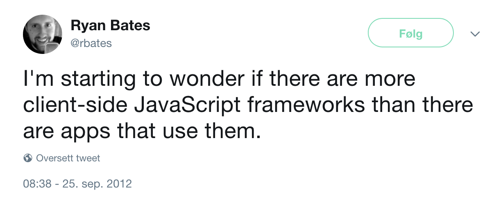

# [fit] Elm


[.footer: Aksel Wester og Johanne Håøy Horn, BEKK Consulting AS]

^	
* Gikk ut av IFI i 2016
* Tok INF2810 (og digga det)
* Jobber i Bekk

---

## Agenda

* FP og webapps
* Syntaks og språkkonsepter
* Liten app 

^ 
* Har 45 minutter til rådighet, så vi har dessverre ikke tid til å gå veldig i dybden på Elm som språk, men forhåpentligvis får dere smaken på noe av syntaksen og eventuelt motivasjon til å se på det på egenhånd. 
* Snakke litt om funksjonell programmering og webutvikling, og erfaringer vi har gjort oss i arbeidslivet.
* Presentere syntaks og noen sentrale språkkonsepter
* Lage en bitteliten webapp.

---

## Funksjonell programmering i arbeidslivet

* God kode
* Brukervennlig, testbar, lesbar kode
* Vi bruker kanskje ikke Scheme, men prinsippene er universelle

^ Aksel: Da jeg skulle velge fag på våren andre året så fikk jeg høre at funksjonell programmering var et kult fag, selv om det ikke er så relevant for arbeidslivet. Men det viste seg å ikke stemme i det hele tatt. Funksjonell programmering er nok et av de fagene jeg har hatt mest nytte av etter at jeg begynte å jobbe.

^ Funksjonell programmering har fått mer og mer fotfeste de siste årene, og man ser at prinsippene i funksjonell programmering er anvendelige på mange forskjellige bruksområder.

^ Noen av grunnene til det er at om man skriver funksjonelt så skriver man kode uten sideeffekter, som gjør det lett å resonnere om hva et program gjør ved å se på koden.

^ Funksjonell kode er også lett å teste og lett å lese, og det blir ofte mindre kode.

---

## Funksjonelle programmeringsspråk
* Lisp-familien: Scheme, Clojure
* ML-familien: Haskell, Elm

^ Aksel: Scheme er et språk i Lisp-familien av funksjonelle språk, som ofte kjennetegnes ved at det er dynamisk typet (og har masse parenteser)

^ Elm er en del av ML-familien, som har veldig mange av de samme konseptene, men med et typesystem i tillegg

^ Men i motsetning til typesystemene dere kanskje er kjent med fra Java, så er typesystemene i ML-språk både mye kraftigere, og mye mindre i veien. Det hjelper deg bare å unngå feil.

---

## <Bilde av en nettside>

^ 
Johanne: I Bekk jobber de aller fleste av oss med å utvikle datasystemer, og da er det gjerne en eller annet web- eller mobilløsning med i miksen.
Siden Elm er et programmeringsspråk for nettsider, er det greit å bruke noen minutter på å snakke om hva en nettside består av, for å forstå hvilken verden Elm befinner seg i.

---

## <Logo av HTML>

^
Johanne:   Dette er sikkert kjent for en del av dere, men en nettside består av HTML, som vi bruker til å strukturere tekst. Det er faktisk ikke et programmeringsspråk, men markup.

---

## <Logo av CSS>

^
Johanne: Vi bruker CSS til å style nettsidene våre, altså for å sette opp layouten vi ønsker, få farger, rett og slett gjøre det pent. CSS hadde faktisk sitt opphav i en doktorgrad fra en fyr her på IFI, som også jobbet i CERN. Litt kult å kjenne til :)

---

## <Logo av JavaScript>

^ Og så selve rosinen i pølsa: JavasScript. JavaScript brukes til å gjøre sidene interaktive, og er helt nødvendig i de fleste nettsider slik vi kjenner dem - hvis man ønsker noe mer enn en statisk nettside

---

### Tegning av fyr med scheme-logo i tankeboble.

^ 
For JavaScript ble laget av en fyr som heter Brendan Eich. Og han ville egentlig lage Scheme i nettleseren.

---

### Tegning av forretningsfolk med java-logo i tankeboble.

^ Men Java var veldig i vinden den gangen, og netscape navigator, nettleseren han skulle lage dette språket for, ville at han skulle ta språket i en mer objektorientert retning.
Og det gjorde han. Ikke minst inngikkk netscape navigator en avtale med sun, som hadde lisensrettighetene til java, om at de fikk lov til å bruke java i navnet til dette nye programmeringsspråket.

---
## Java != JavaScript

^ Men ellers har disse to språkene så å si ingenting å gjøre med hverandre.

---

### JavaScript

* Ikke kompilert
* Dynamisk typet
* Funksjonelt og objektorientert
* Svært fleksibelt

^ JavaScript kompileres ikke, det kjører bare rett i nettleseren. Som scheme, har det ikke statiske typer, det vil si: vi får ikke klager på om vi forsøker å sende inn en int der vi forventer en streng.
Det er et utrolig fleksibelt språk, som har ført til en voldsom innovasjon. 

---



^ 
JavaScript-fatigue
Kan være vanskelig å velge rammeverk og biblioteker.

---

## Tingenes tilstand på frontend

* JS-stacken funker, men er kompleks
* JS har beveget seg i funksjonell retning: React, Redux
* Statisk typing har blitt maintream

^
Statisk typing har blitt mainstream - dvs at man legger på et rammeverk for å type javascript, som regel innebærer dette at man kompilerer javascripten, og da får feilmeldinger hvis man prøver å sende strenger til funksjoner som bare tar tall osv.

---

## Vanlige feil i JS


^
Andre ting som folk irriterer seg grønne over med javascript, er:
* Feiler runtime
* Dårlige feilmeldinger

---
	
`Script error.`

---

`Cannot read property 'getFullYear' of undefined`

---

`Cannot read property 'beskrivelse' of undefined`

--- 

`undefined is not an object`

---

## <Logo av ELM>

^ Johanne: Elm er et alternativ til JavaScript. Og per nå kompileres også Elm til JavaScript, for det er det nettleserne har støtte for å kjøre. Men i fremtiden kompilerer det kanskje til noe annet fordi det er ikke tett knyttet til javascript

---

### _Elm:_ Statisk typet funksjonelt språk

---

### _Elm:_ Laget for å lage webapps

---

### _Elm:_ Lover “ingen kjøretidsfeil”

---

### _Elm:_ Fokuserer på brukervennlighet

---

### _Elm:_ Gode kompilatorfeilmeldinger

^
Null har jo blitt omtalt som the billion dollar mistake - dukket først opp i cobol.
JavaScript har gjort det enda vanskeligere for seg selv med å slenge undefined med I miksen - men Elm har hverken null eller undefined.

---

### _Elm:_ Tydelig, gjennomgående filosofi

^ 
Èn måte å lage webapps på, ikke plukk og miks mellom ulike rammeverk.
Lett å lære, enkelt å bruke. 

---

### _Elm:_ Offisielt anbefalte biblioteker for det man trenger

---

# Funksjoner & typeinferens

```elm
increment x =
    x + 1

five = increment 4
```

^ Aksel frem til det står noe annet

---

# Typesignaturer

```elm

increment : Int -> Int
increment x =
    x + 1

five : Int
five = increment 4
```

---

# Records

```elm
kunde : { navn : String, alder : Int }
kunde = 
    { navn = "Ingar"
    , alder = 24
    }
```

---

# Type alias

```elm
type alias Kunde =
    { navn: String
    , alder: Int
    }

ingar : Kunde
ingar =
    { navn = "Ingar"
    , alder = 24
    }   
```

#### _**lar oss definere nye typer**_

---

# Type alias

```elm
type alias Koordinater = (Int, Int)

spillerposisjon : Koordinater
spillerposisjon = (0,0)
```

---

# Type alias

```elm
type alias Kunde =
    { navn: String
    , alder: Int,
    , type: String
    }

ingar : Kunde
ingar =
    { navn = "Ingar"
    , alder = 24
    , type = "Student"
    }   
```

---

# Type alias

```elm
type alias Kunde =
    { navn: String
    , alder: Int,
    , type: String
    , studentRabatt: Int
    }

ingar : Kunde
ingar =
    { navn = "Ingar"
    , alder = 24
    , type = "Student",
    , studentRabatt = 50
    }   
```

---

# Type alias

```elm
type alias Kunde =
    { navn: String
    , alder: Int,
    , type: String
    , studentRabatt: Int
    , bedriftsnavn: String
    }

ingar : Kunde
ingar =
    { navn = "Ingar"
    , alder = 24
    , type = “Bedrift”,
    , studentRabatt = 0
    , bedriftsnavn = "BEKK Consulting"
    }   
```

---

# Tre problemer:
_1. Vi får tomme felter med_ dummy-_verdier_
_2. Enkelt å skrive feil i `type`-feltet_
_3. Ikke noe hjelp fra kompilatoren_

---

# Union Types

```elm
type Kundeavtale
    = Student
    | Bedrift
    | Privat
```

#### _**som enums på stereoider**_


^ Johanne frem til det står noe annet

---

# Union Types

```elm
type Kundeavtale
    = Student Int
    | Bedrift String 
    | Privat
```

#### _**som enums på stereoider**_

---

# Union Types

```elm
type alias Rabatt = Int
type alias Bedriftsnavn = String

type Kundeavtale
    = Student Rabatt
    | Bedrift Bedriftsnavn 
    | Privat
```

#### _**som enums på stereoider**_

^
Type alias for å gjøre signaturene til typene enklere å lese. Men STudent tar fortsatt en int og bedrift tar fortsatt inn en streng.

---

```elm
type alias Kunde =
    { navn: String
    , alder: Int,
    , avtale: Kundeavtale
    }

ingar : Kunde
ingar =
    { navn = "Ingar"
    , alder = 24
    , avtale = Bedrift “Bekk Consulting”
    }   
```

---

# Pattern Matching

```elm
type Kundeavtale = Student Rabatt | Bedrift Bedriftsnavn | Privat

getRabatt : Kundeavtale -> Rabatt
getRabatt avtale =
    case avtale of
        Student rabatt ->
            rabatt
        Bedrift navn ->
            0
        Private ->
            0
```


#### _**glemt en branch? kompilatoren sier fra!**_

---

# HTML

```html
<div>
    
    <h1>Min elm-app!</h1>
</div>
```

---

# HTML

```elm
div []
    [ img [src “/image.png”] []
    , h1 [] [ text “Min elm-app!”]
    ]
```

^ 
Alle html-elementene har sin egen funksjon i elm, som tar inn to argumenter: en liste med attributter, der vi typisk setter cssen. Og en liste med underelementer.
Likner litt på hvordan vi bruker komponenter i React.

---

### The Elm Architecture

Bilde

^

Redux, som veldig mange etter hvert har omfavnet som måten å håndtere tilstand på i JavaScript-applikasjoner er inspirert av måten Elm hån

---

# Live-koding


^ Aksel


---

# Hvorfor Elm

* Mindre kompleksitet
* Færre bugs
* Enklere refaktorering og vedlikehold
* Hjelpsomt community
* Folk som liker Elm liker det _veldig godt_!

---

# Vil du prøve selv?

```
$ npm install -g create-elm-app
$ create-elm-app min-forste-app
$ elm-app start
```

---

# Andre ressurser

Elm-miljøet har en slack: [elmlang.herokuapp.com](https://elmlang.herokuapp.com)

Elm-workshop: [ewendel.github.io/elm-workshop/](https://ewendel.github.io/elm-workshop/)


^ Elm-miljøet har en slack der alle kan bli med. Alle er veldig vennlige, og de har en policy om at ingen spørsmål er dumme, og alle spørsmål skal få svar. De har til og med en egen beginner-kanal, der det er masse bra hjelp å få.

^ Noen kollegaer av oss i Bekk har også laget en workshop i elm, hvor man lager et lite spill, som de har reist land og strand rundt med. Både i Norge og i utlandet.

---

# Takk for oss


