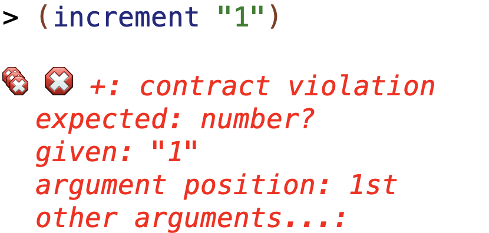
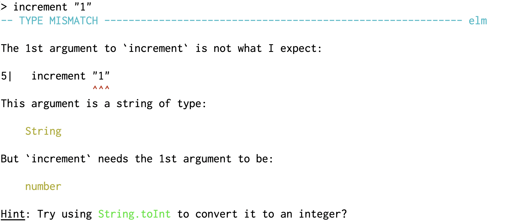

# Elm

### *A delightful language*
### *for reliable webapps*

[.footer: Aksel Wester, Bekk Consulting AS]

^
Da kan vi starte!
I dag skal vi snakke om Elm, et funksjonelt programmeringsspråk for webapplikasjoner.
Jeg heter Aksel Wester, og jeg er så heldig å få snakke med dere om Elm to timer midt i arbeidsdagen.
* Gikk ut av IFI i 2016, gikk Programmering og nettverk på både bachelor og master
* Tok INF2810 som dette faget het da, og jeg digga det.
* I dag: Jobber i Bekk som utvikler. Jeg har jobbet både på frontend og backend,
men jeg liker best å jobbe på frontend, og det er også det jeg gjør på prosjekt nå.
* Jobber på prosjekt på NAV, med React og Elm.

---

## Plan

* Funksjonell programmering og webapplikasjoner
* Syntaks og språkkonsepter, sammenligning med Scheme
* Livekoding
* Dere programmerer
* Oppsummering

^ 
* Snakke litt om mine erfaringer med funksjonell programmering og webutvikling
* Presentere syntaks og noen sentrale språkkonsepter
* Så skal jeg livekode en webapp, og så skal dere få lov til å fortsette på den samme appen og legge til noen features.
* Still gjerne spørsmål underveis! Jeg hatet å stille spørsmål da jeg var student.
Jeg prøvd heller å google meg fram til ting under forelesningen hvis det var noe jeg ikke skjønte.
Men når jeg står på denne siden av forelesningssalen så vil jeg veeeldig gjerne ha spørsmål underveis,
for hvis du ikke skjønner hva jeg sier, eller tenker at noe jeg sier er feil, så er det sikkert 5/40 andre som sitter og lurer på det samme.

---


^ Dette er appen vi skal lage sammen, en todo-app, hvor man kan legge inn, fullføre og slette todos.

---

## Funksjonell programmering i arbeidslivet

* God kode
* Brukervennlig, testbar, lesbar kode
* Vi bruker kanskje ikke Scheme, men prinsippene er universelle

^  Da jeg skulle velge fag på andre året på Bachelor så fikk jeg høre at funksjonell programmering var et kult fag, selv om det ikke er så relevant for arbeidslivet. Men det viste seg å ikke stemme i det hele tatt. Funksjonell programmering er nok et av de fagene jeg har hatt mest nytte av etter at jeg begynte å jobbe.

^ Funksjonell programmering som konsept har fått mer og mer fotfeste de siste årene, og man ser at prinsippene i funksjonell programmering er anvendelige på mange forskjellige bruksområder.

^ Noen av grunnene til det, er at hvis man skriver funksjonelt, så skriver man kode uten sideeffekter, som gjør det lett å resonnere om hva et program gjør ved å se på koden.

^ Funksjonell kode er også lett å teste og lett å lese, og det blir ofte mindre kode.

---


 

^ Scheme er et språk i Lisp-familien av funksjonelle språk, sammen med bl.a. Clojure. Lisp-familien kjennetegnes som oftest ved at språkene er dynamisk typet (og også at de har masse parenteser)

^ Elm er en del av ML-familien, som har veldig mange av de samme konseptene som språk i Lisp-familien, men med et typesystem i tillegg

^ Men i motsetning til typesystemene dere kanskje er kjent med fra Java, så er typesystemene i ML-språk både mye kraftigere, og mye mindre i veien. Det hjelper deg egentlig bare å unngå feil.

---


^ 
Siden Elm er et programmeringsspråk for webapplikasjoner (altså nettsider), er det greit å bruke noen minutter på å snakke om hva en nettside består av, for å forstå hvilken verden Elm befinner seg i.

^ Vi starter helt basic, sånn at alle henger med. Men igjen, hvis det er noe som er uklart så er det sikkert min skyld, ikke deres, så bare still spørsmål om det er noe

---


^
Dette er sikkert kjent for en del av dere, men nettsider er bygget på HTML, som vi bruker til å skrive og strukturere tekst.

^ Html er altså innholdet i en nettside.

---


^
Vi bruker CSS til å style nettsidene våre, altså for å sette opp layouten vi ønsker, få farger, rett og slett gjøre det pent. En litt kul ting for oss på IFI (eller kanskje ikke så kul, kommer an på hva du syns om css), er at CSS faktisk har sitt opphav her på instituttet, som doktorgraden til Håkon Wium Lie.

---


^ Den tredje og siste delen av en nettside er JavaScript. JavaScript brukes til å gjøre sidene interaktive, og er helt nødvendig i de fleste moderne webapplikasjoner slik vi kjenner dem. Hvis man ønsker noe mer enn en statisk nettside med hardkodet tekst, er det JavaScript som man bruker.

^ I de siste årene er det også blitt sånn at det er vanlig å skrive hele applikasjoner, med flere sider, i en og samme JavaScript-app, der JavaScripten genererer htmlen for deg.


---


^ For å gå litt mer i dybden på hvordan en webapplikasjon fungerer så skal vi se på hvordan en webapplikasjon fungerer i samhandling med serveren.

^ Dette er ikke egentlig så viktig for Elm, men dette er sånn som man aldri egentlig lærer eksplisitt i noe fag på ifi, så da tenkte jeg å slenge det med her, siden jeg tross alt har to timer til rådighet. 


---


^ Så dette er spillerne som er med når man laster en nettside, nettleseren (altså browseren), serveren, og databasen.

---


^ Når man gå til en nettside, f.eks. nrk.no så gjør nettleseren en request til serveren og så får man returnert en html fil, som nettleseren rendrer for oss.

^ I statiske sider uten så mye interaktivitet (som nrk.no) er dette kanskje et stort html-dokument, med alle overskrifter på forsiden av nrk osv.
Men i mange tilfeller så er dette html-dokumentet egentlig bare en tittel på siden og en lenke til minst to andre filer.

---


^ Så i tillegg til å rendre innholdet i html-filen så henter nettleseren også de filene som er lenket til fra htmlen,
som oftest en javascript-fil og en css-fil (minst).

^ Og for webapplikasjoner er det i javascript-filen hele innholdet og programmet ligger.

---


^ Så javascripten har ansvar for å rendre alt innhold, og gjøre nettverkskall til serveren for å hente data osv.

^ I dette tilfellet ser vi at javascripten gjør et nettverkskall til serveren for å få noe JSON,
så serveren leser fra databasen sin og returnerer et objekt til nettleseren, som javascripten håndterer.


---


^ Så i moderne webapplikasjoner er det altså JavaScripten som gjør det meste av jobben, ikke serveren (men dette avhenger så klart veldig på nettsiden).

^ Det betyr jo også at det er brukerns hardware som brukes til å kjøre kode, ikke serveren, som betyr at man ofte kan komme langt med små servere, fordi det meste av actionen skjer på brukerens maskin. 

---


^ Så før vi går over til å snakke om Elm, så kan jeg si litt mer om JavaScript, for Elm er jo tross alt et alternativ til JavaScript.

^ 
JavaScript ble laget av en fyr som heter Brendan Eich. Og han ville egentlig lage Scheme i nettleseren.

---


^ Men Java var veldig i vinden den gangen, og netscape, nettleseren han skulle lage dette språket for, ville at han skulle ta språket i en mer objektorientert retning.
Og det gjorde han. Ikke minst inngikkk netscape en avtale med sun, som hadde lisensrettighetene til java, om at de fikk lov til å bruke java i navnet til dette nye programmeringsspråket.

^ Og i tillegg så hadde Sun et utrolig marketingbudsjett for Java: et år brukte de en halv milliard dollar på å reklamere for Java (et programmeringsspråk!), så det var jo også et pluss om det kunne komme javaScript tilgode

---
## Java != JavaScript

^ Men ellers har disse to språkene så å si ingenting å gjøre med hverandre.

---

### JavaScript

* Funksjonelt og objektorientert
* Ikke kompilert
* Dynamisk typet
* Svært fleksibelt

^ 
Funksjonelt og objektorientert.
JavaScript kompileres ikke, det kjører bare rett i nettleseren. Som scheme er det dynamisk typet, det vil si: vi kan sende hva som helst inn til en funksjon, uten at vi vil få noen klager på det, før vi åpner nettsiden og kanskje har fått en kjørefeil (altså en runtime exception).
Det er et utrolig fleksibelt språk, som har ført til en voldsom innovasjon siden det først så dagens lys i 1995.

---


^ 
JavaScript-fatigue
Kan være vanskelig å velge rammeverk og biblioteker.

---

## Tingenes tilstand på frontend

* JavaScript-stacken funker, men er kompleks
* JavaScript har beveget seg i funksjonell retning: React, Redux
* Statisk typing har blitt mainstream

^
JavaScript-stacken (dvs alle de ulike rammeverkene og verktøyene man trenger for å sette opp en webappliakasjon), funker fint, men den er kompleks.

^
De siste årene har JavaScript beveget seg i en mer funksjonell retning, blant annet i rammeverkene React og Redux, som har blitt en slags bransjestandard her til lands, i hvert fall React. 

^
Statisk typing har også blitt mainstream, dvs at man legger på et rammeverk for å type javascript (f.eks. TypeScript eller Flow). Som regel innebærer dette at man kompilerer javascripten, og at man da får feilmeldinger hvis man prøver å bruke typer feil.

---

## Vanlige feil i JS

^
Andre ting som folk irriterer seg over med javascript, er:
* Feiler runtime, det kompileres jo ikke, det kjører bare rett i nettleseren.
* Dårlige feilmeldinger

---
	
`Script error.`

^ Dette er jo en fin feil å få. Ikke så lett å se hva som egentlig har gått galt her.

^ Og hvis du finner denne i loggen til appen din som ligger ute i produksjon, så er det ikke superenkelt å skjønne hva som har gått galt.

---

`Cannot read property 'name' of undefined`

--- 

`undefined is not a function`

^
Null har jo blitt omtalt som the billion dollar mistake - dukket først opp i cobol.
JavaScript har gjort det enda vanskeligere for seg selv med å slenge undefined med i miksen

---


^ Og selv når man ikke får feilmeldinger så blir ikke ting alltid sånn som man har sett for seg i JavaScript.


---

# Don't break
# the web

^ Men det er ikke så lett å være JavaScript, for det er jo tross alt et 24 år gammelt språk.
Og det er et 24 år gammelt språk som aldri har kunnet bryte bakoverkompatabilitet,
fordi det alltid er noen nettsider som bruker de tingene i språket du har lyst til å fjerne eller endre.
Og JavaScript er ansvarlige borgere på nettet, og dette er mottoet deres.
Men selv om det er veldig bra at de ikke bryter bakoverkompatabilitet, for å ikke ødelegge nettet,
så er det ikke det beste utgangspunktet for å lage et språk som funker for nettsider i 2019. 

---


^ Men da, dere, har vi kommet til Elm. Elm er som sagt et alternativ til javascript.

---

### _Elm:_ 
### Laget for webapplikasjoner

^ Det er laget spesifikt for å lage moderne webapplikasjoner.

---

### _Elm:_ 
### Statisk typet, funksjonelt språk

---

### _Elm:_ 
### Lover “ingen kjøretidsfeil”
^
Altså runtime exceptions. Elm har heller ikke verken null eller undefined.

---

### _Elm:_ 
### Gode kompilatorfeilmeldinger

^ Skal se eksempler på dette senere.

---

### _Elm:_ 
### Fokuserer på brukervennlighet

^
Både i språket selv, men også i flyten rundt: feilmeldinger, enkelhet med å komme igang.

---

### _Elm:_ 
### Tydelig, gjennomgående filosofi

^ 
Det er én måte å lage webapps på, en konsensus om hva som er den beste måten.
Lett å lære, enkelt å bruke. 

---

### _Elm:_ 
### Alt inkludert

^
Elm er en helhetlig løsning for webapplikasjoner, som vi i en JavaScript-verden bare kan etterligne ved å kombinere flere rammeverk som React, redux, immutable.js med mer.

^
I JavaScript er det da ikke uvanlig at man har prosjekter med flere tusen, kanskje ti tusener av dependencies. Dette er ikke tilfellet i Elm. Mitt team har f.eks. en fullt fungerende Elm-app i produksjon med 4 dependencies.

---

### _Elm:_ 
### Kompilerer ned til JavaScript

^ Det skal sies, per i dag kompileres Elm ned til JavaScript, for det er det nettleserne har støtte for å kjøre. Men i fremtiden kompilerer det kanskje til noe annet, som WebAssembly.

^ WebAssembly vil også gjøre det vanligere med alternativer til JavaScript, så om noen år (5-10) så vil det nok være enda vanligere å lage nettsider i andre språk enn javascript


---

### _Elm:_ 
### Kompilerer ned til JavaScript


^ Men selv om Elm kompilerer til javascript _er det_ ikke et javascriptrammeverk. Det er et eget språk, som ikke er tett knyttet til javascript. Akkurat som C ikke er spesielt tett knyttet til assembly, og Java ikke er spesielt tett knyttet til JVM bytecode.

^ Det gjør også at Elm står fritt til å endre seg, uavhengig av Javascript, fordi Elm bare kan fjerne/endre features i språket og så kompilere på nytt til den samme javascripten. 

---

# Elm

^ Da er det endelig på tide å se litt elm. Vi skal gå gjennom den grunnleggende syntaksen, og noen nye konsepter dere kanskje ikke har sett i programmeringsspråk før, og så skal vi se på hvordan vi bygger opp programmer i elm.

^ Etter det skal jeg live-kode en app, før dere skal få legge til noen features i appen på egenhånd.

---
# Funksjoner & typeinferens

```elm
-- Elm:

increment x =
    x + 1
```

```scheme
;; Scheme:

(define (increment x)
    (+ x 1))
```

^ Dette er en funksjonsdefinisjon i Elm, og under ser dere det samme i Scheme.

^ Her sier vi altså at increment er en funksjon som tar ett argument: x, og returnerer x + 1. Siden elm er rent funksjonelt, og vi bare kaller funksjoner for returnverdien så har vi ikke noe return-ord. Det er resultatet av evalueringen som returneres, akkurat som i scheme

^ Som dere kanskje ser så behøver man ikke noen parenteser i Elm når man definerer funksjoner, ikke en gang rundt argumenter, sånn som i Java og andre C-lignende språk 

---
# Funksjoner & typeinferens

```elm
-- Elm:

increment x =
    x + 1
    
four = increment 3
```

```scheme
;; Scheme:

(define (increment x)
    (+ x 1))
    
(define four (increment 3))
```

^ Her ser vi at vi binder resultatet av å kalle increment med argumentet 3, til navnet four, i både elm og scheme

^ Heller ikke når man kaller funksjoner i Elm behøver man parenteser rundt argumenter. Man bare skriver navnet på funksjonen så argumentene

---
# Funksjoner & typeinferens


```elm
-- Elm:

increment x =
    x + 1
    
five = increment (increment 3)
```

```scheme
;; Scheme:

(define (increment x)
    (+ x 1))
    
(define five (increment (increment 3)))
```

^ Hvis vi derimot skal sende med resultatet av et funksjonskall som argumentet til en funksjon, da trenger vi parenteser. For hvis vi bare hadde skrevet increment increment 3, uten parenteser så hadde vi fått denne feilmeldingen.

--- 


^ *Les hele høyt*

^ Altså må vi putte på parenteser for å gjøre det tydelig hva som er argumentene til hvilke funksjoner.

---


# Funksjoner & typeinferens


```elm
-- Elm:

increment x =
    x + 1
    
five = increment (increment 3)
```

```scheme
;; Scheme:

(define (increment x)
    (+ x 1))
    
(define five (increment (increment 3)))
```

^ Så i dette tilfellet er det sånn her vi må kalle funksjonene

^ increment (increment 3)

--- 

# Feilmeldinger

^ Og når vi snakker om feilmeldinger, så så dere kanskje at Elm hadde ganske fine feilmeldinger. Kompilatoren foreslo til og med at vi kanskje måtte legge på parenteser.

^ Og feilmeldingene er en av de tingene som gjør Elm så behagelig å jobbe i.

^ Det er også noe som jeg aldri hadde tenkt på før jeg begynte å programmere i Elm, at programmeringsspråk faktisk *kan* ha gode og leselige feilmeldinger!

---



^ Til sammenligning så er dette feilmeldingen man får dersom man kaller increment med en string i stedet for et tall i Scheme.

^ Og det er ikke noe galt med denne feilmeldingen egentlig, man skjønner jo hva som skjer. Kanskje tar det litt tid før man skjønner at det er pluss-funksjonen som er problemet her, og hva en contract violation er, men man finner jo ut av det.

^ Og sammenlignet med andre språk har jo faktisk Scheme ganske brukervennlige feilmeldinger!

^ Da jeg lærte Java på ifi så pleide jeg alltid bare å lete etter et linjenummer i kompilatorfeilmeldingene, og så gå inn i kode og se om jeg kanskje kunne skjønne selv hva som var galt. For det var så vanskelig for meg å forstå feilmeldingene.

---



^ Men i motsetning til det, så er Elm i en klasse for seg selv når det kommer til feilmeldinger. Bare se på det her!

^ Her prøver vi å kalle increment med en string, og så sier den *les hele*

^ ***

^ !Kompilatoren har altså et forslag til en funksjon vi kan bruke for å løse problemet vårt!

^ Feilmeldingene i Elm er altså bare så bra, noen av dem har til og meg lenker til artikler man kan lese for å forstå feilen man har fått.


^ Og så for ordens skyld så kan jeg jo ta med hvordan denne feilen ser ut i JavaScript også da

---


^ Ja... behøver kanskje ikke si noe mer om det

---

# Funksjoner & typeinferens


```elm
-- Elm:

increment x =
    x + 1
    
five = increment (increment 3)
```

```scheme
;; Scheme:

(define (increment x)
    (+ x 1))
    
(define five (increment (increment 3)))
```

^ Som vi så nå, så har Elm en hjelpsom kompilator, som sørger for at vi ikke har noen typefeil, eller andre feil, i programmene våre

^ Og som nevnt tidligere så er Elm et statisk typet språk. Men selv om det har et typesystem, så behøver man ikke si hvilken type alle verdier og funksjoner har, sånn som i f.eks. Java.

^ Så her forstår elm at increment tar et tall som argument og returnerer et tall, på grunn av pluss-operatoren.

^ Den skjønner også at five er et tall pga returverdien til increment

---

# Typesignaturer


```elm
-- Elm:

increment : Int -> Int
increment x =
    x + 1

five : Int    
five = increment (increment 3)
```

```scheme
;; Scheme:

(define (increment x)
    (+ x 1))
    
(define five (increment (increment 3)))
```


^ Men som oftest så har vi lyst til å legge på typesignaturer, og det gjør vi på denne måten.

^ Kolon betyr "har typen", så øverst står det at increment har typen int-til-int, altså er det en funksjon som tar inn en int og returnerer en int

^ five derimot er bare en int. Det er ikke noen piler fordi five ikke er noen funksjon

^ En ting som er fint med typesignaturene til elm, er at de fungerer omtrent som dokumentasjon, i tillegg til å hjelpe kompilatoren. For hvis du ser at en funksjon heter f.eks. `increment` og tar en int og returnerer en int, så behøver du egentlig ikke se på implementasjonen for å skjønne hva den gjør. Og det er sant for veldig mange funksjoner i elm.

---

# Records

```elm
kunde : { navn : String, alder : Int }
kunde = 
    { navn = "Aksel"
    , alder = 29
    }
```

^ For mer komplekse datatyper har elm bl.a. records. En record er litt som et objekt i javascript eller en klasse i java, bare uten metoder og sånt, det er bare en samling verdier. Her lager vi en record `kunde`, som har to felter: `navn` med verdi `Aksel` og `alder` med verdi `29`

^ I tillegg så har vi en typesignatur på `kunde` som sier at dette er en record, der `navn` er en streng, og `alder` er en int.

---

# Records

```elm
kunde : { navn : String, alder : Int }
kunde = 
    { navn = "Aksel"
    , alder = 29
    }
```

^ Og som nevnt tidligere så har ikke Elm verken null eller undefined, så når vi sier at noe er f.eks. en streng, så _er det_ en streng.

^ Ikke en streng nesten alltid, men vi kan ikke være helt sikre. Nei, det er _alltid_ en streng.

^ Og dette gjelder overalt i Elm, det er ikke spesifikt for records

---

# Records

```elm
kunde : { navn : String, alder : Int }
kunde =
    { navn = "Aksel"
    , alder = 29
    }
```

^ Og forresten, så ser kanskje noen av dere på den formatteringen av koden her og tenker "eeeeh, det var rart", og det er litt rart ja.

^ Det er ikke så vanlig i andre språk å putte komma på starten av linja i stedet for slutten. Men dette er sånn kode formatteres på i Elm, men den formatteringen er ikke noe man behøver å gjøre manuelt.

^ Så å si alle Elm-prosjekter som finnes bruker et verktøy som heter elm-format, som formatterer koden hver gang man lagrer en fil.

^ Og selv om formatet er litt rart, og ganske uvant, så blir man fort vant til det. Og det er i tillegg utrolig digg å slippe å ha de diskusjonene med teamet om hvordan man skal formattere koden, for all Elm-kode formatteres helt likt.

^ I tillegg til at du kan se en hvilken som helst kodebase skrevet i Elm og føle deg som hjemme med en gang, som er veldig behagelig.

---

# Type alias

```elm
type alias Kunde =
    { navn: String
    , alder: Int
    }

ingar : Kunde
ingar =
    { navn = "Aksel"
    , alder = 29
    }   
```

^ Fordi vi vil at typesystemet skal hjelpe oss, og ikke være i veien, så har vi noe som heter typealias, som lar oss definere navn på typer. Det gjør vi sånn at vi kan definere typen vår én gang, og så slippe å skrive den flere ganger.

^ Så her definerer vi typealiaset `Kunde` og sier at det er det samme som et record med to felter, `navn` som er en streng, `alder` som er en int.

#### **Lar oss definere nye typer**

---

# Type alias

```elm
type alias Koordinater = (Int, Int)

spillerposisjon : Koordinater
spillerposisjon = (0, 0)
```

^ Her har vi et annet eksempel til på et typealias, hvor vi gir navnet Koordinater til et tuppel av to int’er.


^ Og så sier vi at spillerposisjon har typen Koordinater, og er 0-0

^ Tupler defineres med parenteser og komma mellom verdiene

---

# Type alias

```elm
type alias Kunde =
    { navn: String
    , alder: Int
    , avtale: String
    }

aksel : Kunde
aksel =
    { navn = "Aksel"
    , alder = 29
    , avtale = "Student"
    }   
```

^ En ting som er fint med å bruke typealias er at vi kan endre typealiaset et sted, og så sier kompilator fra alle steder vi må oppdatere programmet vårt.

^ Her har vi lagt til et felt `avtale` i recorden, som er en streng, for å vise at dette er en studentkunde.

---

# Type alias

```elm
type alias Kunde =
    { navn: String
    , alder: Int
    , avtale: String
    , studentRabatt: Int
    }

aksel : Kunde
aksel =
    { navn = "Aksel"
    , alder = 29
    , avtale = "Student"
    , studentRabatt = 50
    }
```

^ Videre så kan vi se for oss at vi legger til et felt `studentRabatt` i typealiaset vårt

---

# Type alias

```elm
type alias Kunde =
    { navn: String
    , alder: Int
    , avtale: String
    , studentRabatt: Int
    , bedriftsnavn: String
    }

aksel : Kunde
aksel =
    { navn = "Aksel"
    , alder = 29
    , avtale = "Bedrift"
    , studentRabatt = 0
    , bedriftsnavn = "Bekk Consulting"
    }
```

^ Men hva nå da? Nå har vi laget en bedriftskunde, som vi ser på `avtale`-feltet, og vi har lagt til et felt i typealiaset som heter `bedriftsnavn`

^ Men vi har jo fortsatt studentRabatten, selv om det ikke er noen studentkunde, fordi studentRabatt er definert i typealiaset vårt.

---

# Tre problemer:
_1. Vi får tomme felter med_ dummy-_verdier_
_2. Enkelt å skrive feil i `avtale`-feltet_
_3. Ikke noe hjelp fra kompilatoren_

^ 1, 2, 3

^ ... i JavaScript så ville vi kanskje godtatt at det er sånn man modellerer objekter, men ikke i elm!

---

# Custom Types

```elm
type Kundeavtale
    = Student
    | Bedrift
    | Privat
```

#### **Som enums på stereoider**


^ Disse problemene kan vi løse i Elm ved å bruke det som heter custom types.

^ Custom types er litt som enums, men mye mye kraftigere. Og for de av dere som ikke kjenner til enums, er det en type man definerer til å være et sett med konstanter.

^ Custom types deklareres ved å skrive type og så navnet på custom typen - her Kundeavtale.
Og i vårt tilfelle opererer vi med tre ulike avtaler: Student, Bedrift og Privat.

^ Det betyr da at det bare er tre gyldige verdier når vi bruker typen Kundeavtale: Student eller Bedrift eller Privat, og alt annet vil kompilatoren klage på.

---

# Custom Types

```elm
type Kundeavtale
    = Student Int
    | Bedrift String 
    | Privat
```

^ Så var det jo sånn at vi hadde en studentrabatt og et bedriftsnavn på type aliaset vårt. Som gjorde at vi måtte sette dummyverdier. Men i elm, kan Custom types ha argumenter. Så i stedet for å ha et eget felt for studentrabatt, sender vi en int med student-typen. Og en streng til bedriftavtalen. Privatkunder har ingen ekstra informasjon, så den trenger ikke noen argumenter.

---

```elm
type alias Kunde =
    { navn: String
    , alder: Int
    , avtale: Kundeavtale
    }

aksel : Kunde
aksel =
    { navn = "Aksel"
    , alder = 29
    , avtale = Bedrift "Bekk Consulting"
    }   
```

^
Tilbake til eksempelet med kunde-typen, her har vi nå erstattet avtale-strengen med vår nye custom type
Og vi har ikke lenger unødvendige og forvirrende felter, bare den informasjonen vi faktisk trenger i dette tilfellet.

---

# Pattern Matching

```elm
type Kundeavtale = Student Int | Bedrift String | Privat

getRabatt : Kundeavtale -> Int
getRabatt avtale =
    case avtale of
        Student rabatt ->
            rabatt
        Bedrift navn ->
            0
        Private ->
            0
```


#### **Glemt en branch? kompilatoren sier fra!**


^
Når vi ønsker å håndtere de ulike tilfellene vi har definert at en custom type kan ha, bruker vi det som heter pattern matching. 
Likner litt på en switch, som man finner i blant annet java, c# og javascript, men hjelper oss mye mer. For her må vi håndtere alle tilfeller, det holder ikke å bare plukke ut de vi tror vi trenger å håndtere.

^Virker kanskje litt voldsomt, men det å måtte håndtere alle brancher, og få hjelp fra kompilatoren, fører til at vi skriver kode som faktisk fungerer, også etter refaktoreringer og utvidelser.

---

# Maybe

```elm
type Maybe a
    = Just a
    | Nothing
```
^ Så skal vi snakke om Maybe. Dette er måten elm slipper å ha null, undefined eller lignende

^ På definisjonen så ser vi at Maybe er en custom type, som enten er Just eller Nothing. Den a-en der betyr bare en vilkårlig type.

---

# Maybe

```elm
type Maybe a
    = Just a
    | Nothing

type alias Game = 
    { highscore: Maybe Int
    }
```

^ Her ser vi at vi definerer et spill med en highscore som har typen Maybe Int. Det vil si at highscore _enten_ er Just med en int, _eller_ Nothing, hvis det ikke finnes noen highscore. F.eks. ved starten av appen, når man ikke har spilt ennå.

^ Maybe er litt som en optional, bare at man er tvunget til å ta hensyn til tilfellet der verdien ikke er tilstede

---

# Maybe

```elm
type Maybe a = Just a | Nothing

type alias Game = 
    { highscore: Maybe Int
    }

getHighscore : Game -> String
getHighscore game =
    case game.highscore of
        Just score ->
            toString score
        Nothing ->
            "No highscore"
```

^ Her ser vi hvordan det brukes, i en case. Og det kule med elm er at man _må_ ta hensyn til alle tilfeller i en case, så det er ikke mulig å bare anta at highscore er der, og risikere en NullPointerException eller lignende. Vi blir tvunget til å sjekke for å få tilgang til verdien.

^ Selv om dette sikkert virker litt slitsomt, så er det egentlig ikke det, fordi når man blir tvunget til å ta stilling til når man faktisk _trenger_ at noe er optional, så merker man at det egentlig ikke er _såå_ ofte man trenger det.  

^ Og i alle de tilfellene der man ikke trenger en optional, så behøver man aldri å tenke på om noe kanskje er null

---

# HTML

```html
<div>
    
    <h1>Min elm-app!</h1>
</div>
```

^
Som jeg nevnte tidligere, er elm en fullstendig løsning for webapplikasjoner. Og elm har dermed sin egen måte å skrive html på.

^ Det er kanskje noen av dere som ikke har sett html før. Men her har vi altså et div-element med to underelementer: et bilde og en header.

^ + forklare barn, attributter

---

# HTML

```html
<div>
    
    <h1>Min elm-app!</h1>
</div>
```

```elm
div []
    [ img [ src "/image.png" ] []
    , h1 [] [ text "Min elm-app!" ]
    ]
```

^ 
Overordnet, er strukturen veldig lik den vi har i html, med attributter og barn. Men html-elementer er nå egne funksjoner i elm. Det vil sei at div er en funksjon, img er en funksjon, h1 (header) er en funksjon osv. Og hver av html-elementene tar inn to argumenter: en liste med attributter, der vi typisk setter css-klasser og events. Og en liste med barn.

---

## The Elm Architecture

^  Det siste vi skal snakke om før vi skal live-kode er The Elm Architecture.

^ Elm-arkitekturen er måten vi strukturer programmene våre på i elm. Arkitekturen består av 3 elementer, en modell, et view og en update-funksjon. Dette vil virke kjent for dere som har brukt redux i javascript, for Elm var faktisk en viktig innflytelse på Dan Abramov som lagde Redux.

---


^ Model: tilstanden til programmet

^ Modellen inneholder all data vi har i programmet, og er det eneste stedet den dataen lever

---


^ View: en funksjon som tar modellen som argument og lager et brukergrensesnitt basert på det

---


^ Update: en funksjon som tar imot beskjeder OG en modell, og returnerer en ny modell

---


^ Starter med en modell som lager et view, view sender beskjeder (f.eks. ved at brukeren trykker på en knapp), og update tar imot beskjeden og lager en ny modell, som igjen oppdaterer viewet, som kan sende beskjeder, og sånn går det, i en evig rund-dans

---

# The Elm Architecture

```elm
type alias Model = {...}
type Msg = BrukerTrykketPaaEnKnapp | NoeAnnetSkjedde

view : Model -> Html Msg

update : Msg -> Model -> Model

```

^ Her er signaturene til de forskjellige elementene til elm-arkitekturen

^ Vi har et typealias `Model` som vi definerer selv, og custom typen Msg som vi også definerer selv

^ Så har vi de to funksjonene, `view` som tar modellen som argument og returnerer Html. Og der ser vi også at det står Html Msg, fordi vi definerer at Html’en vår kan sende Msg-typen.

^ Til slutt har vi update funksjonen som tar to argumenter: `Msg`-typen vi har definert, og modellen vi har definert, og så returnerer funksjonen en ny modell

^ Det virker kanskje litt rart at update har piler mellom argumentene også, i stedet for f.eks. komma, men det gir faktisk veldig mening, selv om vi ikke har tid til å forklare hvorfor i dag.


---

# [fit] Live-koding

---

# Dere programmerer

---


---

# Dere programmerer

*https://tinyurl.com/elm-in2040-2019*

---

# Løsning

^ Hele løsningen er 150 linjer eller noe sånt! En fullt fungerende webapp 

---

# Løsning

https://tinyurl.com/elm-in2040-2019-solution

---


---


---


---


---


# Hvorfor Elm

* Funksjonell programmering!
* Mindre kompleksitet
* Færre bugs
* Enklere refaktorering og vedlikehold
* Hjelpsomt community
* Folk som liker Elm liker det _veldig godt_!

---

# Vil du prøve selv?

*Starte et prosjekt:* create-elm-app / parcel.js
*Editor:* IntelliJ med Elm-pluginet
*Deploye til internett:* netlify

^ Slå et slag for IntelliJ til Java også

---

# Andre ressurser
_Introduksjon til Elm:_ [guide.elm-lang.org](https://guide.elm-lang.org)

_Elm-miljøet har en slack:_ [elmlang.herokuapp.com](https://elmlang.herokuapp.com)

_Podcast:_ Elm Town

^ Elm-miljøet har en slack der alle kan bli med. Alle er veldig vennlige, og de har en policy om at ingen spørsmål er dumme, og alle spørsmål skal få svar. De har til og med en egen beginner-kanal, der det er masse bra hjelp å få.

---

# [fit] *?*

---

# [fit] *Takk*


